# CMS for Values Education
The project is a Content Management System for Values Education. As a teacher, you can add books and games for primary school students in the project. The students gain score through reading book, and then play games if the student's score is enough for the game.

**Membership Types**
* Admin
* Teacher
* Student

**Database**
* Microsoft Access (the folder of `App_Data`)

**Requirements**
* IIS Server (32-bit must be true)
* Read and Write Permissions
* ASPUpload Component

**Demo Accounts**
* Admin: kemalozcan:123456
* Teacher: emrecoban:123456
* Student: yunusemre:123456

## :tr: Features (Turkish)
### Genel Bilgi ve Özellikleri
* 	Web tabanlı Değerler Eğitimi Sistemi Classic ASP programlama dili ile kodlanmıştır.
* 	Verilerin depolanması işlemi Microsoft Access veritabanı ile sağlanmıştır.
* 	“Yönetici” ve “Öğretmen” yetkisine sahip kullanıcıların arayüz tasarımı Adobe Fireworks aracı ile çizilmiştir.
* 	Tasarımın web üzerinde etkileşimli hale gelebilmesi için HTML/CSS kullanılmıştır.
* 	Bunun yanı sıra ek olanaklar sunması amacıyla JavaScript web programlama dilinden faydalanıldı.
* 	Uzun metinlerin kolay biçimlendirilmesi amacıyla “CKEditor” aracı kullanılmıştır. 
* 	Karşı tarafa dosyaların gönderilmesini sağlamak için “ASPUpload” bileşeninden yararlanılmıştır.
* 	Sistem üç farklı yetkilendirmeden oluşur: “Yönetici”, “Öğretmen” ve “Öğrenci/Çocuk”
* 	“Öğretmen” yetkisine sahip kullanıcılar sadece kendi alanında bulunan “Öğrenci”, “Kitap”, “Soru” ve “Oyun” verileri üzerinde işlem yapabilir.
* 	Her “Öğretmen” yetkisine ait kullanıcı farklı bir sınıf anlamı taşır. 
* 	Sisteme girişlerin izlenebilmesi için “Log” kayıt işlemi yazılmıştır.
* 	Verilerin toplam miktarını görebilmek için işleme ait toplam bilgiler yazdırılmıştır.
* 	“Yönetici” ve “Öğretmen” yetkisine sahip kullanıcılar aynı form ekranını kullanır.
* 	Sisteme kayıtlı bütün kullanıcılar giriş yapma ve çıkış yapma yetkisine sahiptir.
* 	Daha önce oluşturulmuş kullanıcı adı ile hesap açılması engellenmiştir.
* 	Bütün sıralama yapılan sayfalarda ‘Sayfalama’ kullanılarak veriler daha düzenli listeletilmiştir.
* 	“Yönetici” ve “Öğretmen” yetkisine sahip kullanıcıların sistemde daha pratik işlemlerini gerçekleştirilmesi için bağlantıların kolay bulunabilir olması sağlanmıştır.
* 	Sisteme yüklenecek olan resim formatındaki dosyalara “.jpg, .jpeg, .gif, .png” olarak dört farklı resim yükleme sınırlandırılması getirilmiştir.
* 	Sisteme yüklenecek olan oyunların sadece “.swf” olması için diğer formatların yüklenebilmesi engellenmiştir.
* 	Öğrenci giriş sayfası ve menülerin olduğu sayfa Adobe Illustrator aracı ile çizilmiştir.
* 	Öğrenci sayfasında bulunan kitapların listelenebilmesi için CSS3 yardımıyla raflık biçiminde listeleme kullanılmıştır. Yine CSS3 yardımıyla animasyon özelliği kazandırılmıştır.
* 	Öğrencilerin diğer sayfalara geçişinin kolay olabilmesi için “Kitaplık, Oyunlar, Ayarlar” sayfalarının tasarımı Adobe Fireworks ile büyük ikonlu menüler kullanarak tasarlanmıştır.
* 	Kitap sayfalarında geçişin kolay olabilmesi ve kullanılabilirliği arttırmak için “jQuery BookBlock” eklentisi kullanıldı.

### Güvenlik
* 	Özellikle verilerin URL üzerinden transfer edildiği zamanlarda yabancı karakterlere karşı önlem alınmıştır.
* 	Kullanıcıların karşı sunucuya dosya transferi aktarımı sırasında yükleyebileceği formatlara sınırlandırma getirilerek zararlı yazılımlardan korunaklı  hale getirilmiştir.
* 	Sisteme ait bütün sayfalarda (giriş sayfası dahil) kullanıcı kontrolü yapılmıştır.
* 	Sisteme giriş yapan kullanıcı giriş sayfasını, giriş yapamayan kullanıcı içerik yönetim sayfalarını görebilmesi engellenmiştir.
* 	Oturum yönetiminde “Session” kullanılarak güvenlik düzeyi arttırılmıştır.
* 	“Güvenli Çıkış” bağlantısı ile kullanıcıya ait bütün bilgilerin düzenli bir şekilde silinmesi sağlanmıştır.
* 	Sisteme giriş yapmayı deneyen bütün ziyaretçilerin I.P. adresi kayıt altına alınmıştır.

### Yetkilendirmeler: Yönetici
* 	“Öğretmen” yetkisine sahip kullanıcılar üzerinde bütün yetkilere sahiptir.
* 	Öğretmenleri, ‘Ad Soyad, Kullanıcı Adı, Kota’ biçiminde sıralama.
* 	Toplam öğretmen sayısını ve öğretmenlerin toplam öğrenci(kota) sayısını görebilir.
* 	Yeni öğretmen ekleyebilir. ‘Ad Soyad, Kullanıcı Adı, Parola, E-Posta, Kota’
* 	Öğretmen bilgilerini düzenleyebilir.  ‘Ad Soyad, Kullanıcı Adı, Parola, E-Posta, Kota’
* 	Öğretmenleri silebilir.
* 	“Kullanıcı Bilgilerim” formu ile yönetici bilgileri değiştirebilir.
* 	“Hesap Geçmişleri” ile sisteme giriş yapan veya yapamamış kullanıcıları (yönetici dahil) ‘Tarayıcı, I.P. Adresi, Giriş Zamanı, Kullanıcı Adı, Durumu’ biçiminde sıralama.
* 	“Genel Ayarlar” sayfasında sisteme ait özellikleri değiştirebilir. ‘Bilgi Ekranı’ sayesinde “Öğretmen” yetkisine sahip tüm kullanıcıların başlangıç sayfasına duyuru gönderebilir.
* 	Kota miktarı yerine sayı dışında karakter ve kullanıcı adı bölümlerine Türkçe karakter girilmesi engellenmiştir.

### Yetkilendirmeler: Öğretmen
* 	Başlangıç sayfası ile ‘Bilgi Ekranı’na düşen bildirileri görebilir.
* 	“Öğrenci” yetkisine sahip kullanıcılar üzerinde bütün yetkilere sahiptir. 
* (Sadece öğretmene ait öğrenciler üzerinde)
* 	Öğrencileri, ‘Ad Soyad, Kullanıcı Adı, Puan’ biçiminde sıralama.
* 	Hesabına ait kotasını, kalan kotasını, daha önce oluşturmuş olduğu öğrencilerinin toplam puanlarını ve oluşturduğu öğrenci sayısını görebilir.
* 	Eğer kalan kotası 0 (sıfır) ise yeni öğrenci oluşturabilmesi engellenmiştir.
* 	Yeni öğrenci ekleyebilir. ‘Ad Soyad, Kullanıcı Adı, Parola, E-Posta, Yaş’
* 	Öğrenci bilgilerini düzenleyebilir. ‘Ad Soyad, Parola, E-Posta, Yaş’
* 	Öğrencileri silebilir.
* 	Kitapları, ‘Kitap Adı, Sayfa, Oluşturulma Tarihi’ biçiminde sıralama.
* 	Toplam kitap sayısı ve kitaplara ait sayfa sayısını görebilme.
* 	Yeni kitap ekleyebilir. ‘Kitap Adı’
* 	Kitap bilgilerini düzenleyebilir. ‘Kitap Adı’
* 	Kitabın içinde eğer daha önce sayfa oluşturulmamış ve soru yayınlanmamış ise kitabı silebilir aksi halde kitabı silebilmesi için önce sayfaları silmesi veya soruları silmesi için uyarı mesajı alır.
* 	Sayfaları, ‘Resim, Özet’ biçiminde sıralama.
* 	Kitaba ait toplam sayfa sayısını görebilme.
* 	Yeni sayfa ekleyebilir. ‘Sayfa İçeriği, Resim’
* 	Sayfa bilgilerini düzenleyebilir. ‘Sayfa İçeriği, Resim’
* 	Sayfaları silebilir.
* 	Soruları, ‘Kitap Adı, Soru’ biçiminde sıralama.
* 	Toplam soru sayısını görebilme.
* 	Yeni soru ekleyebilir. ‘Kitap, Soru, CevapA, CevapB, CevapC, Doğru Yanıt’
* 	Soruları düzenleyebilir. ‘Kitap, Soru, CevapA, CevapB, CevapC, Doğru Yanıt’
* 	Soruları silebilir.
* 	Oyunları, ‘Resim, Oyun Adı, Puan’ biçimde sıralama.
* 	Toplam oyun sayısını görebilme.
* 	Yeni oyun ekleyebilir. ‘Oyun Adı, Puan, Resim, Oyun Dosyası’
* 	Oyun bilgilerini düzenleyebilir. ‘Oyun Adı, Puan, Resim, Oyun Dosyası’
* 	Oyunları silebilir.
* 	“Kullanıcı Bilgilerim” formu ile kendine ait bilgileri görüntüleyebilir veya düzenleyebilir.
* 	“Hesap Geçmişim” sayfasında kendi kullanıcı adına son 20 giriş kaydını listeleyebilir.

### Yetkilendirmeler: Öğrenci
* Bağlı olduğu öğretmene ait kitapları listeler ve okur.
* 	Kitaba ait soruları kitap sonunda cevaplandırabilir bu sayede puanını her doğru cevap için 5 puan arttırabilir.
* 	Toplam puanına göre, bağlı olduğu öğretmenin eklemiş olduğu oyunlardan sadece puanının yeterli olduğu oyunları oynayabilir.
* 	Ayarlar sayfasından öğretmeni tarafından oluşturulmuş profiline ait bilgileri görüntüleyebilir ve düzenleyebilir.
* 	Toplam puanını görüntüleyebilir.
* 	Sadece puanı ve altındaki oyunları listeleyebilir ve oynayabilir.

## Screenshots
### Login
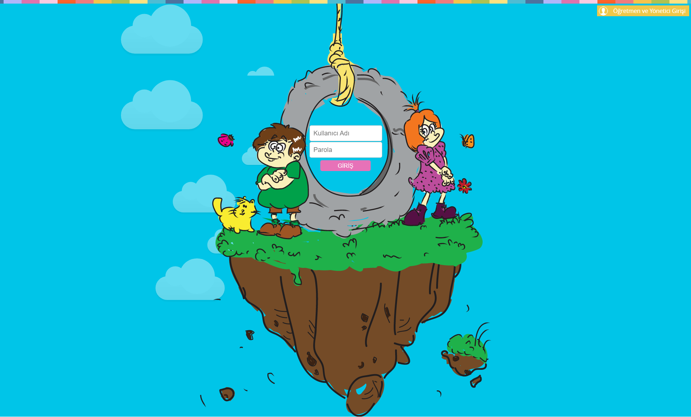
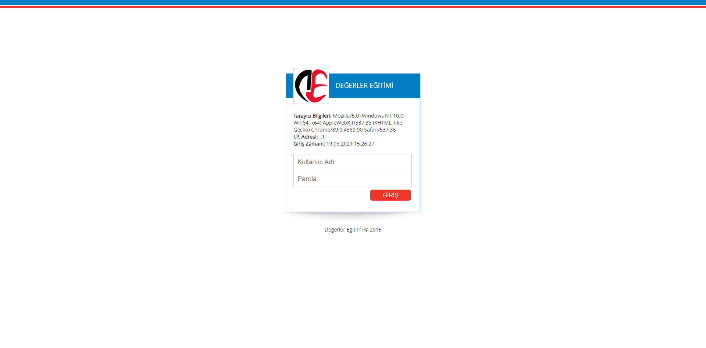
### Student
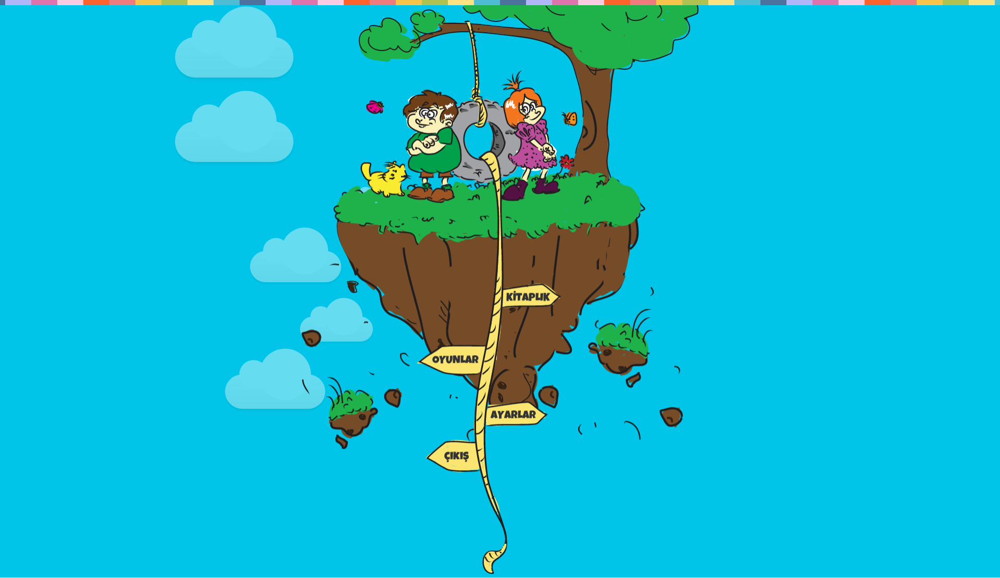
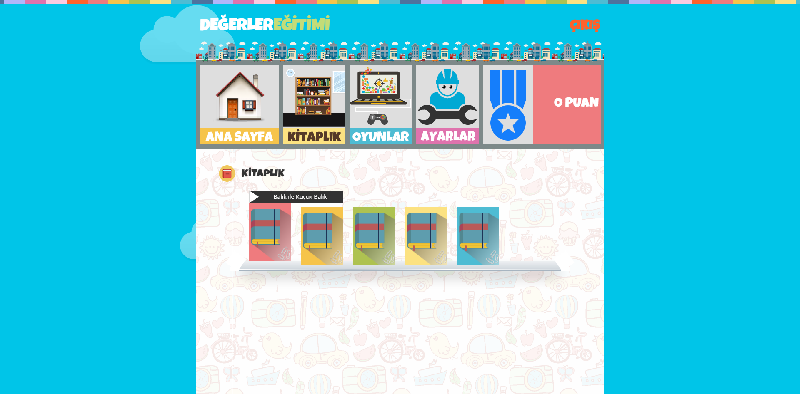
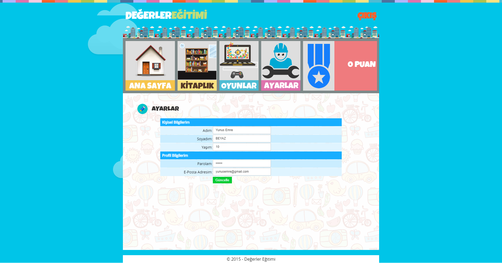
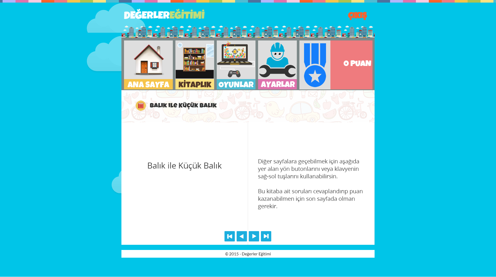
### Teacher and Admin
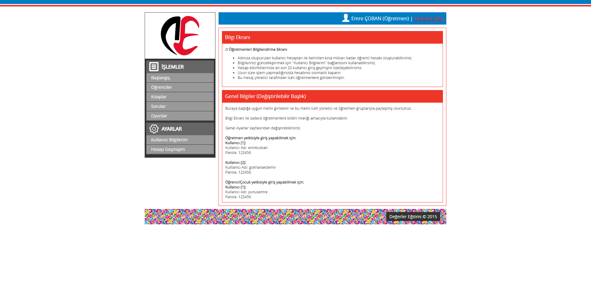
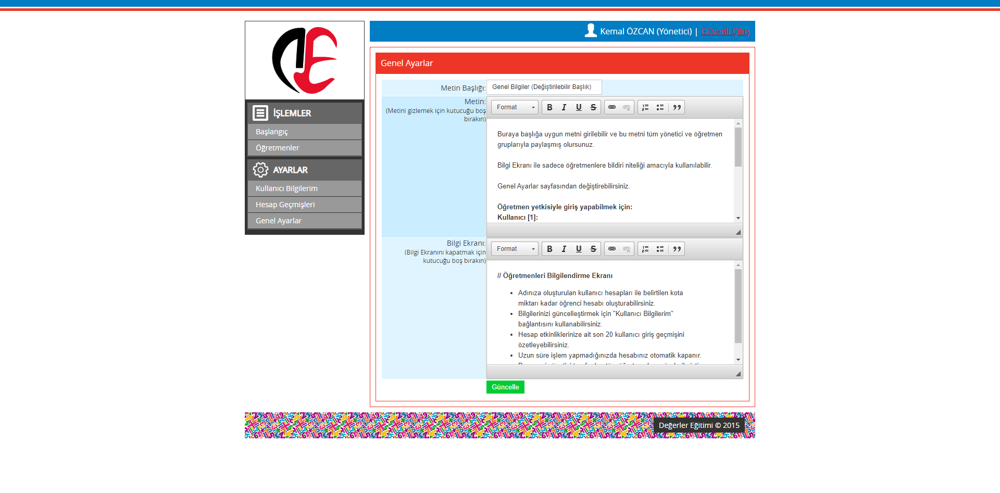
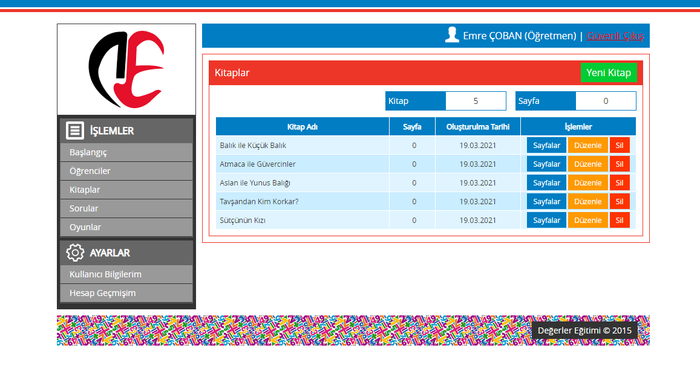
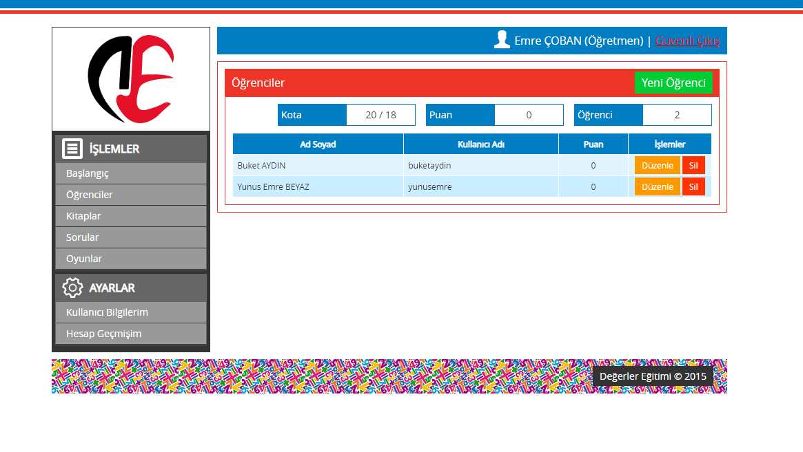
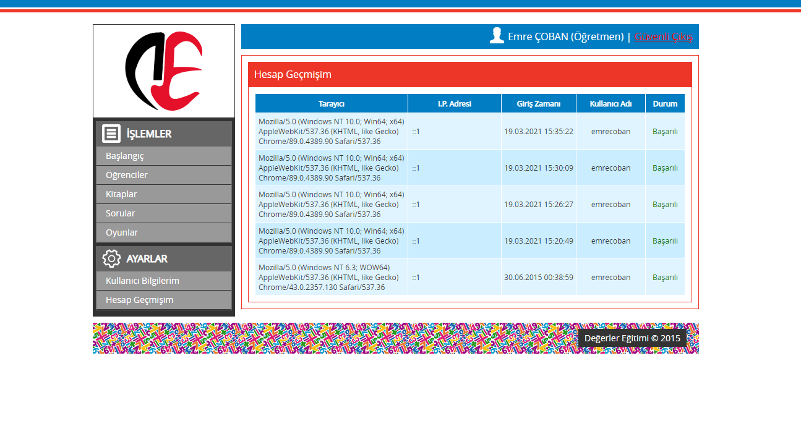
